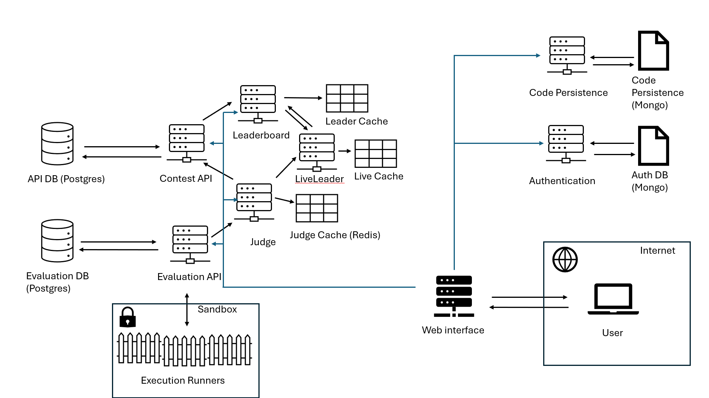

# Distributed Coding Competition

All in one cloud native solution for administering coding competitions with user configurable and manageable contests.


## Service Diagram



* ASP.NET Core Blazor
* .NET Aspire
* MongoDB
* Postgres
* Redis
* Docker
* [Piston](https://github.com/engineer-man/piston)

# Development
## Piston 
*Code Execution Sandbox*

Start from Linux/WSL 
```
docker run \
    -v $PWD:'/piston' \
    --tmpfs /piston/jobs \
    -dit \
    -p 2000:2000 \
    --name piston_api \a
    ghcr.io/engineer-man/piston
```


## SMTP Dev server
*Email Server for development*

https://github.com/rnwood/smtp4dev

```
docker run --rm -it -p 5000:80 -p 2525:25 rnwood/smtp4dev
```

## Tailwind.CSS

```
cd ./DistributedCodingCompetition/DistributedCodingCompetition.Web/
tailwind-(watch|build).(cmd|sh)
```

## Execution Runner
*Sandbox manager*

```
cd ./DistributedCodingCompetition/DistributedCodingCompetition.ExecRunner/
dotnet run
```

## Application cluster

```
cd ./DistributedCodingCompetition/DistributedCodingCompetition.AppHost/
dotnet run
```


## TODO

- [x] User registration
- [x] User login
- [x] User logout
- [ ] User change password
- [ ] User delete account
- [x] Create Contest
- [ ] Edit Contest
